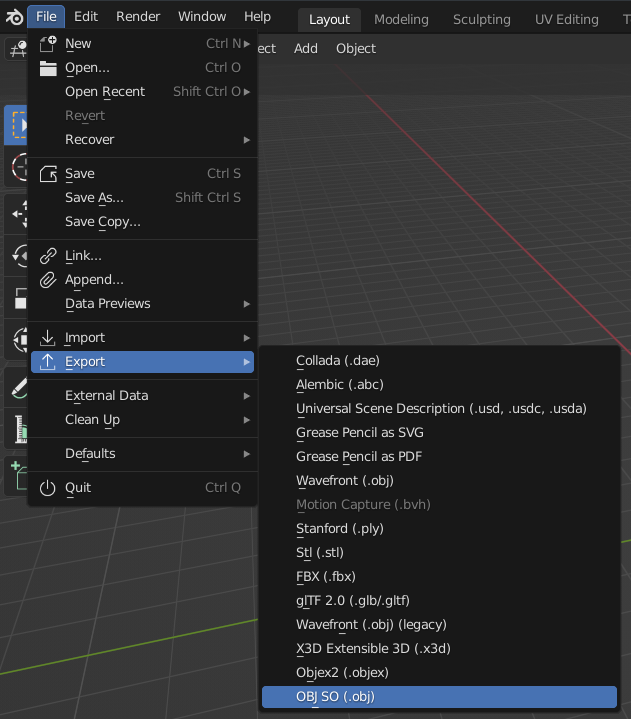
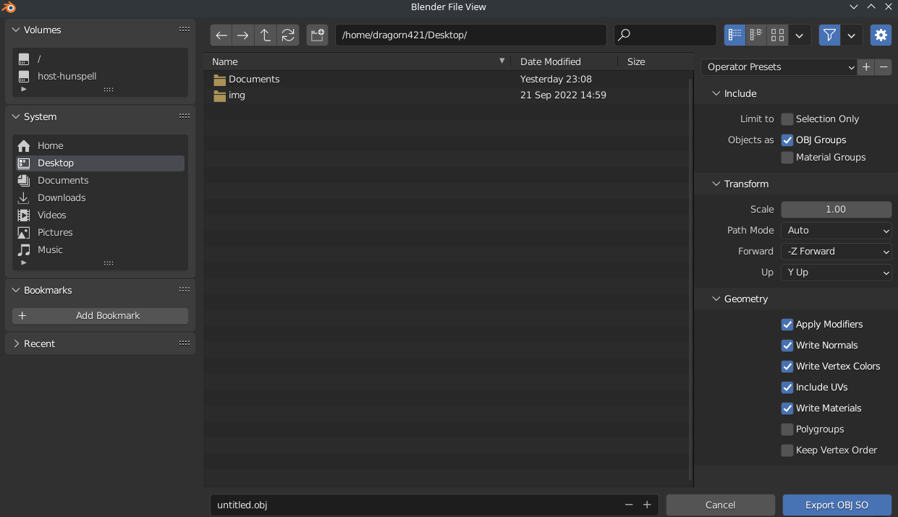

This addon is outdated, it has been supplanted by https://github.com/z64tools/io_export_so2

# export_obj_so

This is a .obj exporter aimed at exporting for SharpOcarina, for Zelda64 modding.

It supports vertex colors and is more robust than other exporters.

See also Simple Material Helper: https://github.com/Dragorn421/SimpleMaterialHelper

## Install

Download the `export_obj_so.py` file from releases: https://github.com/z64tools/export_obj_so/releases

Install that `export_obj_so.py` file as an addon.

For how to install addons, see the Blender manual: https://docs.blender.org/manual/en/latest/editors/preferences/addons.html

## Screenshots

